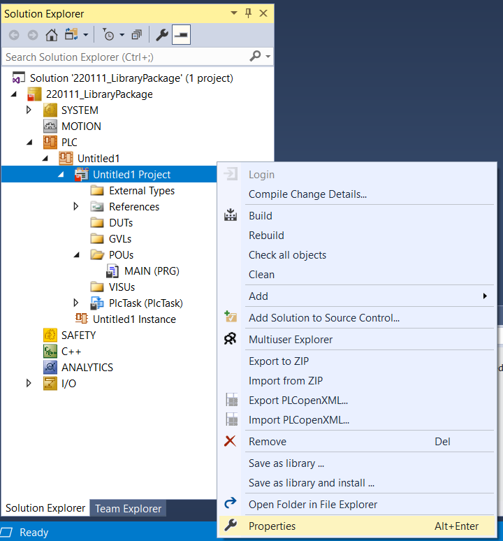
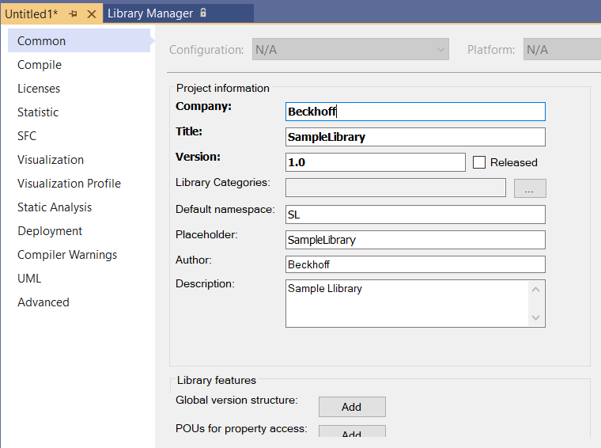
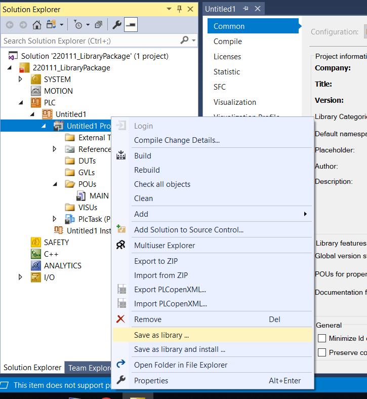
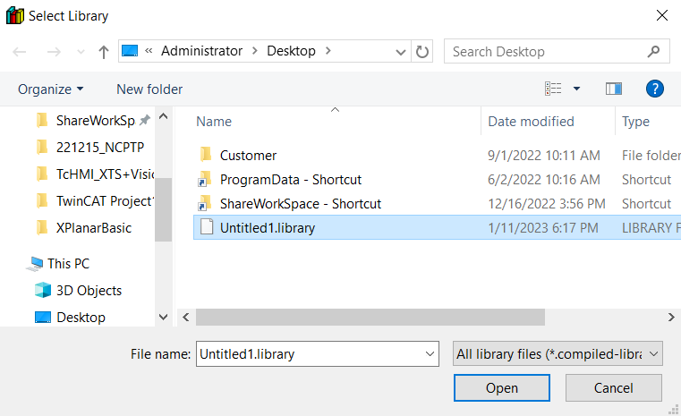
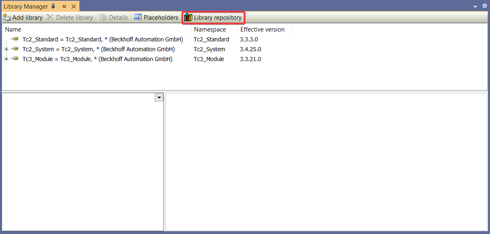
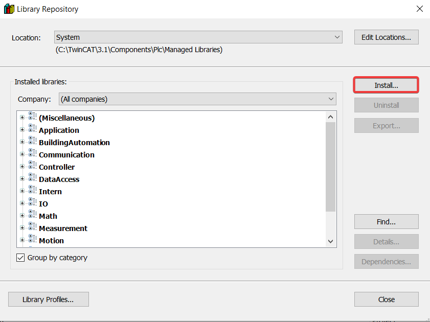
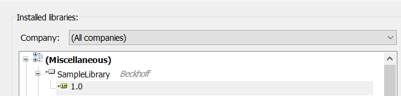
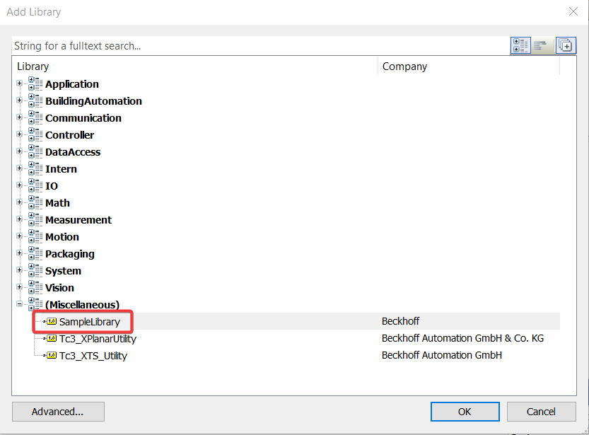
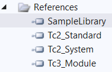

# ユーザー Library の作り方

## Library の作成

PLC > Project で右クリックする。  
Properties を選択する。  

太字の項目は必須項目です。  
Project Infomation に Library の情報を入力します。  

PLC > Project で右クリックする。  
Save as library ... を選択する。  

Library ファイルとして保存する。  

## Library の使用方法

### Library を TwinCAT に登録する

PLC > Project > References を開く。  
Library Manager が表示される。  
Library repository を選択する。  

Install を開く。  
ダイアログが表示されるので、インストールしたい library ファイルを選択する。  

作成した Library が TwinCAT に登録される。  

### Library を PLC Project に適用する

Library Manager > Add library を開く。  

登録した Library を追加する。  

登録した Library が References に追加される。  

