# Cam 設定手順

<!-- TOC -->

- [前提](#前提)
- [Cam の導入](#cam-の導入)
  - [NC Task を追加する](#nc-task-を追加する)
  - [Axis を追加する](#axis-を追加する)
  - [Master を追加する](#master-を追加する)
  - [Slave を追加する](#slave-を追加する)
- [Cam の作成](#cam-の作成)
  - [Motion の作成](#motion-の作成)
  - [グラフの形状を変える](#グラフの形状を変える)

## 前提

TE1510 : Cam Design Tool
Cam のデータを保存する場合に使用する。

## Cam の導入

### NC Task を追加する

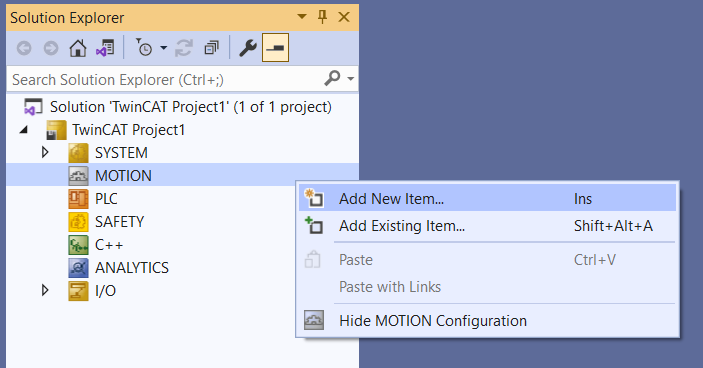  
MOTION > Add New Item...を選択する。

  
目的の NCTask を作成する。

### Axis を追加する

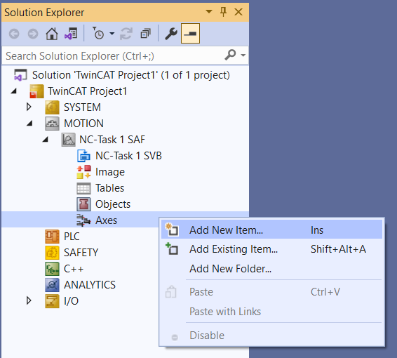  
Axes > Add New Item...を選択する。

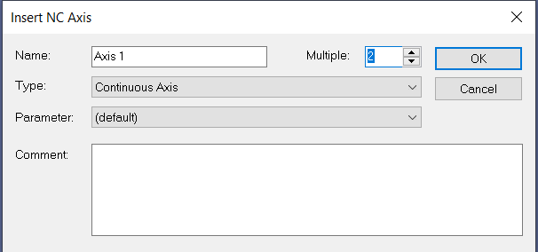  
Master と Slave 用に 2 軸 Continuous Axis を追加する。

### Master を追加する

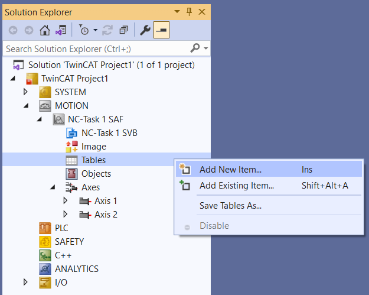  
Tables > Add New Item...を選択する。

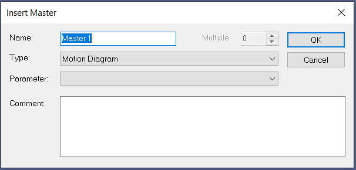  
Motion Diagram で Master を追加する。

### Slave を追加する

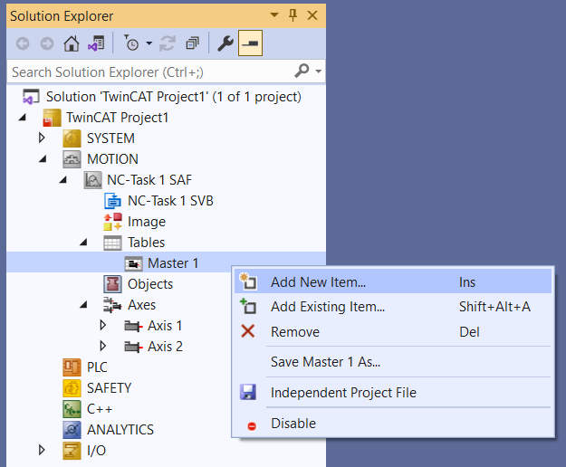  
Master > Add New Item...を選択する。

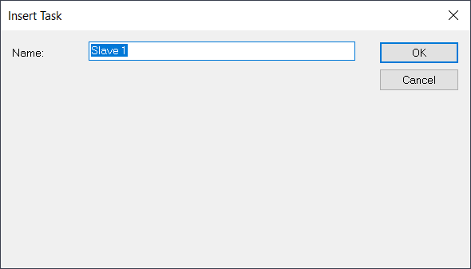  
Slave を追加する。

## Cam の作成

### Motion の作成

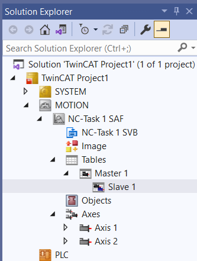  
Slave を選択します。

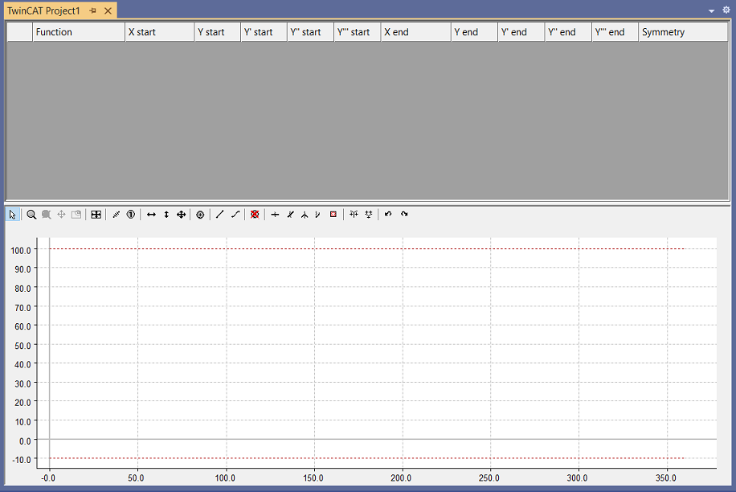  
上がポイントの情報画面(上部)
下がプロファイル画面(下部)

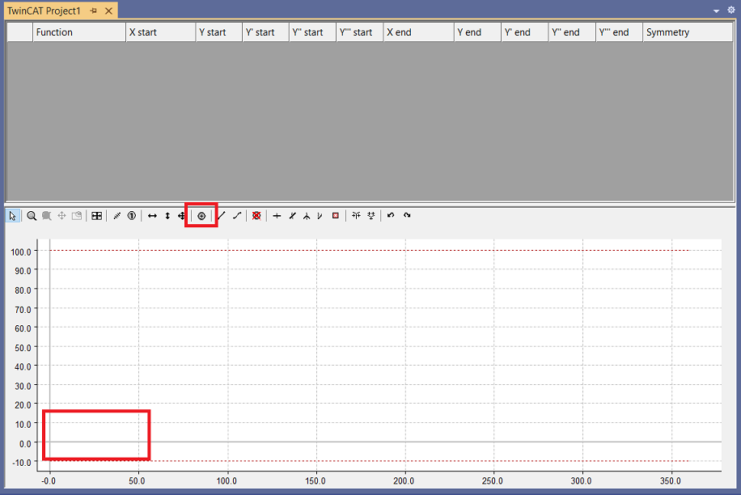

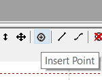  
Insert Point を選択します。

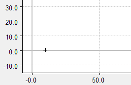  
下部にポイントを作る。

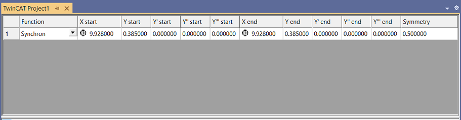  
ポイントができると上部にポイントのデータが自動生成されます。

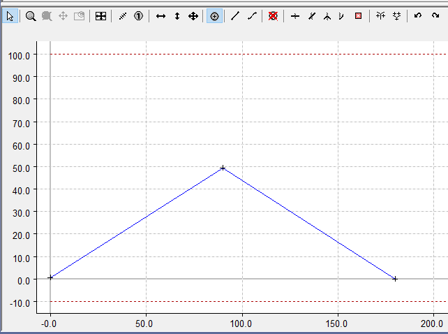  
ポイントを 2 つ追加する。

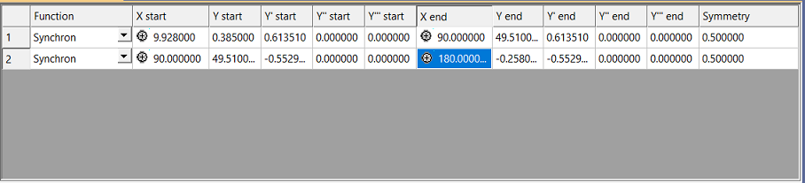  
上部のデータも自動追加されます。

### グラフの形状を変える

  
上部の Fuction でグラフの形状を変更できます。

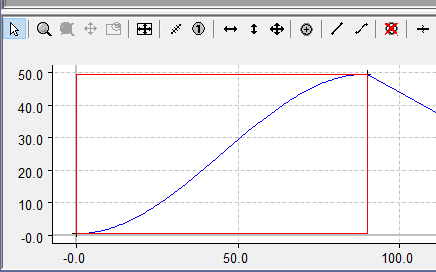  
Function に合わせてグラフが変化します。
