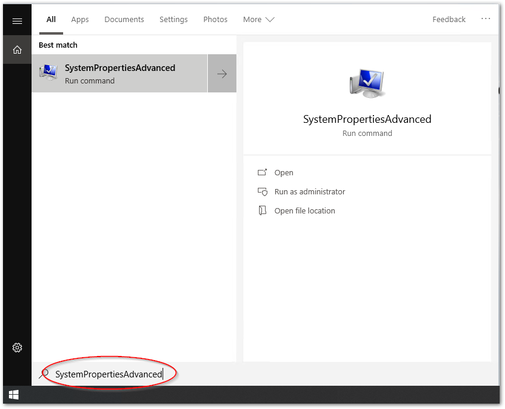

# BSoD対策

BSoDが発生した際には、下記の3つのレベルに応じたメモリダンプファイルへ出力することが可能です。原因調査にはこれらのファイルが必要となります。

最小ダンプ  
:   2MByte程度のページングファイルを用いて意図せずWindowsが終了した際のログを記録します。

自動ダンプ  
:   150～2GByteのページングファイルを用いて、意図せずWindowsが終了した際のログを記録します。カーネルプログラムの問題追跡に役立ちます。ページングするメモリサイズによっては完全には記録されなくなります。

完全ダンプ  
:   カーネルプログラムだけではなく、ユーザプログラムの異常も記録します。全物理メモリファイルに加えて400Mbyteのページングファイルを用意する必要があります。

このダンプファイルはメモリサイズに応じた大容量のストレージの空き容量を必要とします。
したがって、システムの環境によっては空き容量が十分ではなく、確実にこれらのダンプファイルが残らない事があります。

{ align=right }

本書の手順では完全ダンプファイルを確実に記録する事を目指した手順を示します。そのために十分な空き容量のストレージを用意し、そこへページングファイルとダンプファイルを出力するための設定を行います。

まずは準備として下記の通りNTFSでフォーマットされたUSB接続の外部ストレージドライブ（HDDタイプ）をIPCのUSBポートへ接続してください。


!!! Warning
    -   USBメモリなどのリムーバブルドライブは使用できません。また、固定ドライブでもSSDはBSoD中アクセスできない機種があります。外付けHDDをご選択ください。
    -   十分な空き容量が `C:`
        ドライブにある場合は、外付けのストレージを取り付ける必要はありません。ただし、本手順書のドライブ名を
        `C:` と読み替えてください。
    -   外付けストレージが不要になった場合は、本書の逆手順で設定を元にもどしてください。


本書では `D:` ドライブに接続したものとして説明します。

## 仮想メモリ設定

キー  
:   ``HKEY_LOCAL_MACHINESYSTEMCurrentControlSetControlCrashControl``

値  
:   ``DedicatedDumpFile``

データ  
:   \<ドライブ名\>+\<パス\> (文字列値)


1. `String Value` 型のエントリを新規作成
    {width="600px"}
2. エントリー名を `DedicatedDumpFile` に設定
    {width="600px"}
3. ダブルクリックして値を保存先に設定する。例とえば、Dドライブが外付けUSBストレージでその直下に`dedicateddumpfile.sys`という名前で仮想メモリファイルを作る場合は右図の通り設定する。
    {width="600px"}
4. 続いて、`DWORD (32bit) Value` 型のエントリを以下の通り新規作成する。
    
    キー:  
      ``HKEY_LOCAL_MACHINESYSTEMCurrentControlSetControlCrashControl``

    名前:  
      ``DumpFileSize``

    データ:  
      メインメモリが *M* GByte とすると 1024*M* + 400 の整数値 (DWORD値)

    
    {width="600px"}

    エントリー名を <code>DumpFileSize</code> に設定
    {width="600px"}

    ダブルクリックして値を設定

    値の基数を10進数 <code>Decimal</code> に設定し、メモリ容量 + 400
    MByteの整数値をMByteの単位で設定する。計算方法としては メインメモリが
    GByte とすると1024M + 400 となる。 例えば 8 Gbyteの場合は次の通り設定する。
    
    {width="600px"}


## ダンプファイル保存設定


1. スタートメニューから`Search`を選択

    {width="400px"}

2. `SystemPropertiesAdvanced` と入力してEnterキーを押します。

    {width="600px"}

3. `Advanced` タブが開いている事を確認し、`Startup and Recovery`内の `Settings...` ボタンをクリックします。

    {width="800px"}

4. 次の3点を変更します。

    Write debugging information
    :   Automatic memory dump > Complete memory dump

    Dump file
    :   外付けストレージ内に保存するダンプファイル名

    Disable automatic deletion of memory dumps when disk space is low
    :   OFF > ON

    {width="500px"}

## 設定確認

設定が正しく反映されているか確認するためには、BSoEを実際発生させる必要があります。Microsoft社のドキュメントから下記のURLを参照して実施してください。

<https://learn.microsoft.com/ja-JP/troubleshoot/windows-client/performance/generate-a-kernel-or-complete-crash-dump#manually-generate-a-memory-dump-file>

-   NotMyFaultツール

    <https://download.sysinternals.com/files/NotMyFault.zip>

!!! Note
    **NotMyFaultツールはAdministrator権限で実施する必要があります。**
    NotMyFaultツールは32bit版64bit版のOS向けにそれぞれ用意されています。正しいファイルで実行してください。

## ダンプファイル解析手順

1.  下記サイトにある Windows SDK からインストールする方法で WinDbg
    をインストールします。

    <https://learn.microsoft.com/ja-jp/windows-hardware/drivers/debugger/debugger-download-tools>

2.  インストールが終了したら管理者権限で WinDbg を起動します。

3.  シンボルサーバの設定

    最初に、ファイルメニューから `Symbol file path ...`
    を選択し、現れたウィンドウに次の文字をコピーペーストしてOKボタンを押します。

    ``` powershell
    Srv*c:\symbols*\\mainserver\symbols*https://msdl.microsoft.com/download/symbols
    ```

1.  メモリダンプファイルの読み込み

    ファイルをファイルメニューの `Open crash dump...` を選択して保存した
    `MEMORY.DMP`
    を読み込みます。これにより最初にシンボル解析を行います。

2.  シンボル解析が終了すると、下記の通り現れます。最後の `!analyze -v`
    の部分のリンクをクリックする事で、ダンプファイルの解析を始めます。

    ``` powershell
    Loading User Symbols
    .............................
    Loading unloaded module list
    ...
    For analysis of this file, run !analyze -v
    ```

1.  解析が終了するとレポートが出力されます。下記に抜粋した部分の最下部にある様に、
    `PROCESS_NAME`
    を記載されている項目に、問題のあったプログラムが明示されます。

    ``` powershell
    FILE_IN_CAB:  MEMORY.DMP

    BUGCHECK_CODE:  d1

    BUGCHECK_P1: ffffdb88c69df720

    BUGCHECK_P2: 2

    BUGCHECK_P3: 0

    BUGCHECK_P4: fffff801995b12d0

    READ_ADDRESS:  ffffdb88c69df720 Paged pool

    BLACKBOXBSD: 1 (!blackboxbsd)


    BLACKBOXPNP: 1 (!blackboxpnp)


    PROCESS_NAME:  notmyfault64.exe
    ```
