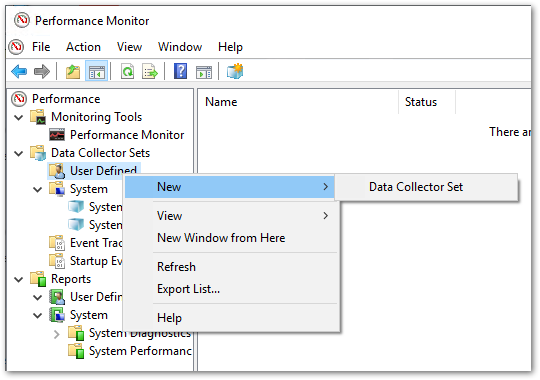
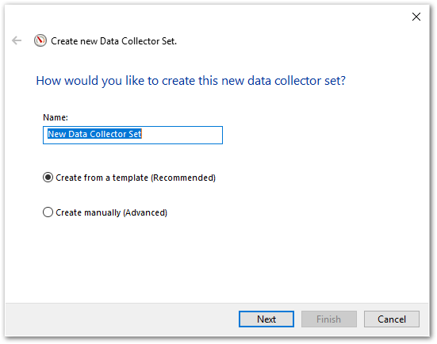
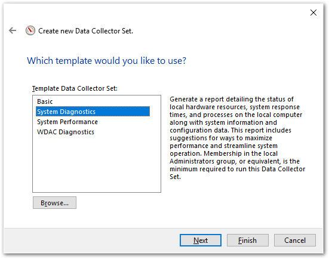
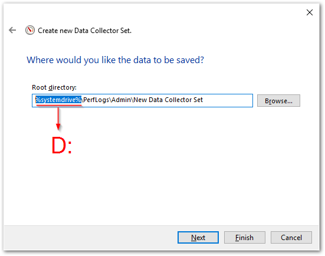
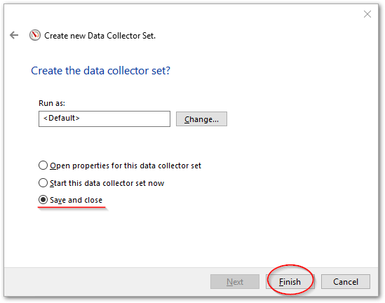
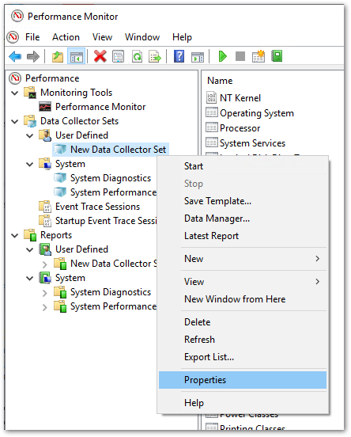
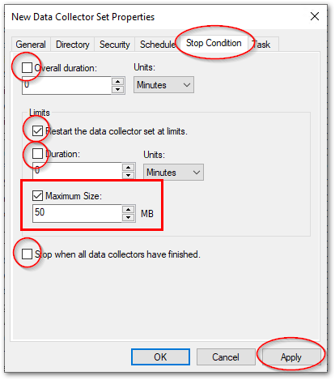
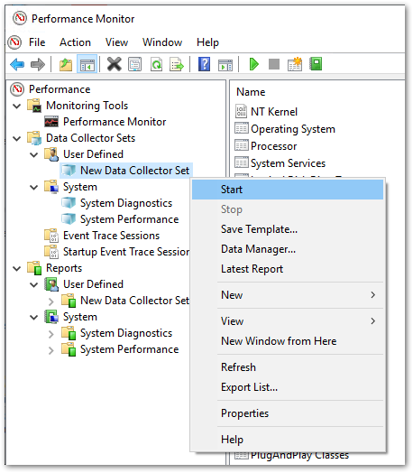

# パフォーマンスモニタによる監視

本節では、パフォーマンスモニタにて連続稼働中のプログラムの挙動の変化を監視し、システムに悪い影響を及ば差ないか監視するための設定手順を示します。
連続稼働によりログは非常に大きなサイズを占めますので、この手順では ``D:`` ドライブとして外付けストレージを設置し、そこへ記録するものとして説明します。

1. スタートメニューより検索を選び、 ``perfmon`` と入力

2. ``User Defined`` から ``New Data Collector Set`` を選択して ``Next``　ボタンを押す

    

3. ``Name:`` に適当な名前（初期値のままで良い）を設定し、 ``Create from a template`` が選択された状態で ``Next`` ボタンを押す

    

4. ``System Diagnostics`` を選択して ``Next`` ボタンを押す

    

5. ``Root directory:`` 入力項目で、 ``%systemdrive%`` の部分を外付ストレージのドライブレターへ変更して ``Next`` ボタンを押す

    

6. ``Save and close`` を選択して ``Finish`` ボタンを押す

    

7. ``User Defined`` フォルダ下に作成した ``New Data Collector Set`` が追加されるため、右クリックして現れたポップアップメニューから ``Properties`` を選択

    

8. ``Stop Condition`` タブを開き、次の通り設定変更したあと、``Apply`` , ``OK`` ボタンを順にを押す

    ``Overall duration``
    :   ON > OFF

    ``Restart the data collector set at limits.``
    :   OFF > ON

    ``Duration``
    :   ON > OFF

    ``Maximum Size``
    : OFF > ON, 小分けにしたいログサイズ[

    ``Stop when all data collections have finished.``
    :   ON > OFF

    

9. 再度 ``New Data Collector Set`` を右クリックし、 ``Start`` を選択する。これにより指定したフォルダパスへログが出力される。以後小分けにしたサイズ毎にフォルダが分かれてログを保存する。

    

!!! Warning
    外付ドライブを取り外す際は、事前に `perfmon` を起動し、 `User Defined > New Data Collector Set` を右クリックし、 `Stop` を行い、ログ記録を停止させてください。
