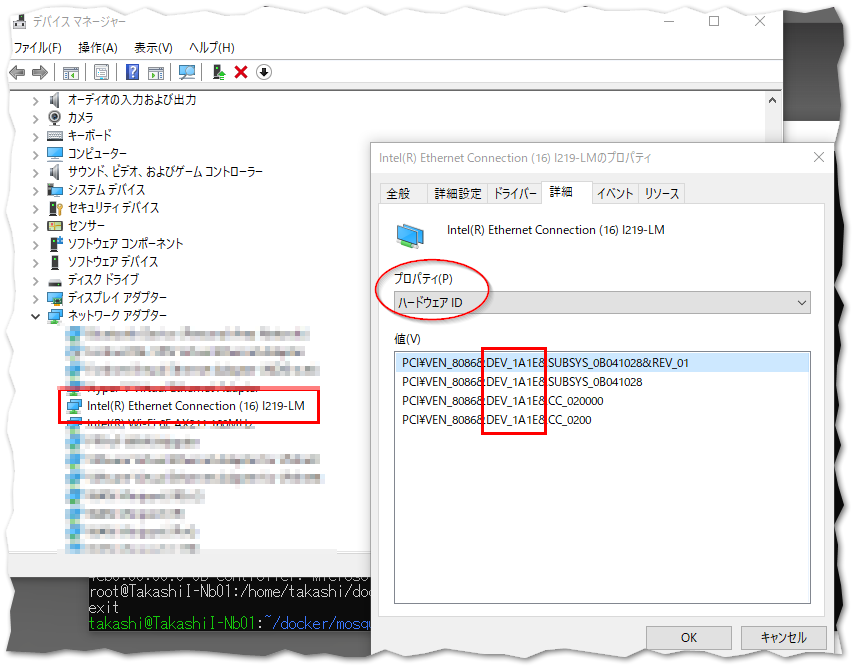

# リアルタイムEthernetドライバ互換性調査方法

[関連InfoSys](https://infosys.beckhoff.com/content/1033/tc3_overview/9309844363.html?id=1489698440745036069)

デバイスマネージャからEthernetボードを選択し、詳細タブからプロパティにて「ハードウェアID」を選ぶと一覧される内容から読み取れます。
VEN_に続く文字がベンダーIDで、DEV_に続く文字がデバイスIDです。



この値が、 [InfoSysサイト](https://infosys.beckhoff.com/content/1033/tc3_overview/9309844363.html?id=1489698440745036069) で案内しているサポートするリアルタイムEthernetドライバに含まれるか確認してください。

!!! info
    このサイトの先頭に、 ``Last updated: TwinCAT *.* ****`` に記載されているTwinCATバージョンのものをお使いください。古いバージョンの場合はこのサイトに掲載されていたとしても Compatible driver とならない可能性があります。

BSDの場合、 ``lspci`` に ``-nn`` オプションを付けて、その出力からethernetという文字が含まれる行をフィルタリングして得られます。

```shell
$ lspci -nn | grep -i ethernet
00:1f.6 Ethernet controller [0200]: Intel Corporation Ethernet Connection (2) I219-LM [8086:15b7] (rev 31)
```

の様に末尾に "[vendor ID:device ID]" の書式で表示されます。

